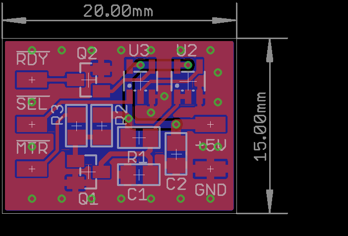

# amiga-DSKRDY
This is a small mod board that will provide a DSKRDY signal for drives which don't have one - commonly the case with "PC" disk drives.
Often there are modifications out there which claim to provide a !DSKRDY signal, but they are not actually proper !DSKRDY signals... this can cause issues with some disk routines and will show up as an issue in Amiga Test Kit, for example.

According to the Amiga spec, one should wait either 500ms OR for !DSKRDY to asset, after turning on the drive motor. Many trackloaders on the Amiga simply wait for !DSKRDY to be asserted, and will hang when it never happens. A good example of this is the Escom Amigas which shipped with a modified mainboard, which only diverted the !DSKCHG signal to the correct pin. The Amiga OS itself seems to always use a 500ms wait, so it is not affected by the lack of !DSKRDY.

As we don't have a real !DSKRDY signal to work from, the circuit works by simply asserting !DSKRDY roughly 500ms after !MTR and !SEL are asserted. It is designed onto a small 15x20mm PCB, which can be stuck to the bottom of a floppy drive and wires run to appropriate pads during modification.

## Whats in this repository

The schematic and board design are available, and were made with CadSoft EAGLE (burn in hell, Autodesk). 
There is also a PDF of the schematic.

The "gerber" folder contains suitable Gerber files for having the PCB manufactured. Any good PCB manufacturer should be able to do this - I personally use [JLCPCB](https://jlcpcb.com)
